# GOKWORKS — Kullanım rehberi

GOKWORKS; SolidWorks dosyalarını toplu aktarmak, montajlardan ürün ağacı
çıkarmak, sac ve profil kesimlerini planlamak ve mühendislik hesapları yapmak
için geliştirilmiş Türkçe bir masaüstü uygulamasıdır.

Sol menüde beş grupta 21 araç bulunur: **Aktarım** (PDF, DXF/DWG, 3D),
**Montaj** (BOM, isimlendirme), **Üretim** (Nesting, Akıllı Parça Bölme,
profil kesim, K faktörü, parametrik mil, DFM, sac açınımı), **Hesaplar**
(geçme ve geometrik toleranslar, tolerans yığılması, cıvata, tork, ağırlık,
hidrolik ünite) ve **Makine Elemanları** (dişli, kayış–kasnak).

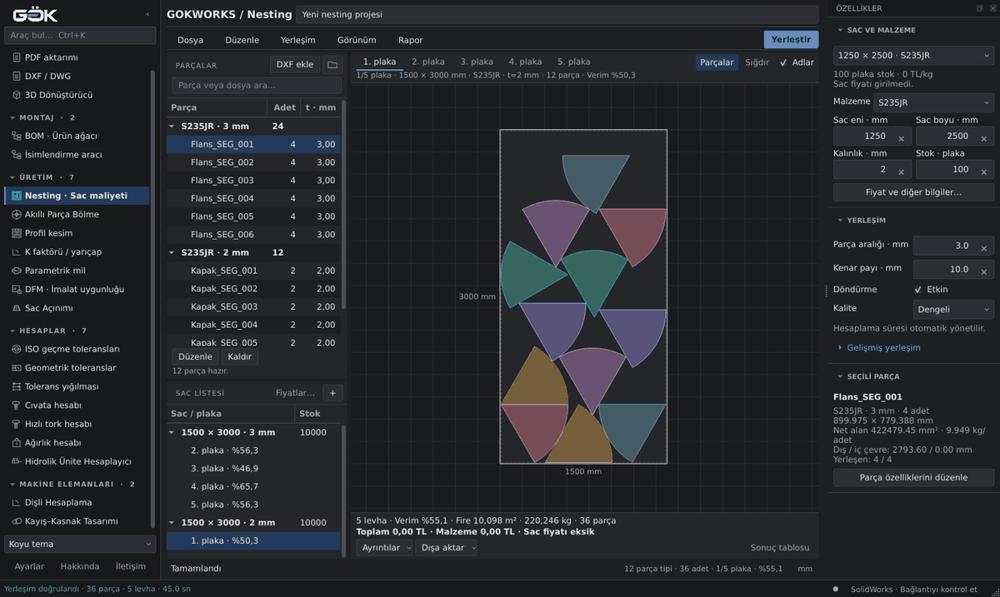

[Telif, lisans ve bağımlılıklar](#telif-lisans-ve-bağımlılıklar) · [Başlangıç](#başlangıç) ·
[Araç seçimi](#hangi-aracı-kullanmalıyım) · [Adım adım kullanım](#adım-adım-kullanım) ·
[Sorun giderme](#sorun-giderme) · [Kurulum ve güncelleme](#kurulum-ve-güncelleme) ·
[İletişim](#geliştirici-ve-iletişim)

## Telif, lisans ve bağımlılıklar

**© 2026 Orhan Gökkızıl — GOKWORKS.** Uygulamayla birlikte dağıtılan üçüncü taraf
bileşenler kendi lisanslarına tabidir. Lisans metinleri uygulama içinde
**Hakkında** ekranından görüntülenip dışa aktarılabilir; depoda
[`packaging/licenses/`](packaging/licenses) klasöründe ve
[üçüncü taraf bildirimlerinde](docs/THIRD_PARTY_NOTICES.md) bulunur.

| Bileşen | Sürüm | Lisans | Kullanım |
| --- | --- | --- | --- |
| Python | 3.13 | PSF | Çalışma zamanı (EXE içinde) |
| PySide6 / Qt Widgets | 6.10.3 | LGPL-3.0 | Arayüz |
| ezdxf | 1.4.3 | MIT | DXF okuma/yazma |
| Shapely (GEOS) | 2.1.2 | BSD-3-Clause (GEOS: LGPL-2.1) | Geometri, nesting, bölme |
| openpyxl | 3.1.5 | MIT | Excel raporları |
| Pillow | 13.0.0 | MIT-CMU | Görseller |
| pywin32 | 312 | PSF tarzı | SolidWorks COM bağlantısı (Windows) |
| cadquery-ocp-novtk (OCCT 8.0.1) | 8.0.1.1.0 | Apache-2.0 (OCCT: LGPL-2.1 + istisna) | STEP ve katı model işlemleri |
| GNU LibreDWG (`dwg2dxf`) | 0.13.3 | GPL-3.0-or-later | DWG okuma; ayrı program olarak çalışır, GOKWORKS koduna bağlanmaz ([bildirim](packaging/licenses/LibreDWG-NOTICE.txt)) |
| PyInstaller | 6.16.0 | GPL-2.0+ ve bootloader istisnası | Yalnız EXE oluşturma; uygulamayı GPL yapmaz |

SolidWorks, Microsoft Excel, ODA File Converter ve AutoCAD uygulamayla
dağıtılmaz. SolidWorks gerektiren işlemler kullanıcının kendi lisanslı kurulumunu kullanır.

## Başlangıç

<!-- windows-release:start -->
Önceki Windows EXE yayınları depo bakımı sırasında kaldırıldı.
Yeni Windows paketi henüz yayımlanmadı; yeni bir EXE derlemesi ayrıca başlatılacaktır.
<!-- windows-release:end -->

1. Elinizde oluşturulmuş `GOKWORKS.exe` varsa çift tıklayarak açın. Kaynak
   kod kullanıyorsanız aşağıdaki kurulum adımlarını uygulayın.
2. CAD aktarımı yapacaksanız SolidWorks'ü açın. İşlemde kullanılacak teknik
   resmi, parçayı veya montajı ve doğru konfigürasyonu kontrol edin.
3. Sol menüden yapmak istediğiniz işleme uygun aracı seçin.
4. Kaynak dosyaları veya hesap değerlerini girin. Dosya oluşturulacaksa
   çıktı klasörünü de belirleyin.
5. İşlemi başlatın; tamamlandığında durum ve açıklamaları inceleyip çıktı
   dosyalarını seçtiğiniz klasörde kontrol edin.

### Kullanım için neler gerekir?

| Yapacağınız işlem | Gerekenler |
| --- | --- |
| EXE'yi çalıştırma | Windows 10/11, 64 bit. EXE için Python kurulumu gerekmez. |
| SolidWorks dosyalarını okuma veya CAD işlemi yapma | Kurulu SolidWorks ve aynı Windows kullanıcı oturumunda açık SolidWorks. |
| Hesap araçları, manuel profil kesimi ve DXF nesting | SolidWorks bağlantısı gerekmez. |
| Nesting'e veya Akıllı Parça Bölme'ye DWG ekleme | Ek kurulum gerekmez: DWG, uygulamanın içindeki LibreDWG ile okunur. Bilgisayarda ODA File Converter kuruluysa önce o kullanılır. |

Excel raporu oluşturmak için Microsoft Excel, DXF/DWG nesting için AutoCAD
kurulumu gerekmez.

## Hangi aracı kullanmalıyım?

| Yapmak istediğiniz iş | Sol menüdeki araç | SolidWorks gerekir mi? |
| --- | --- | --- |
| Teknik resimleri PDF'e çevirmek | [PDF aktarımı](#pdf-aktarımı) | Evet |
| Sac parçalarının açınımlarını almak | [DXF / DWG](#dxf-ve-dwg-açınımı) | Evet |
| Parça veya montajları STEP, Parasolid, IGES, STL olarak kaydetmek | [3D Dönüştürücü](#3d-dosya-aktarımı) | Evet |
| Parça adedi, ürün ağacı ve Excel raporu almak | [BOM · Ürün ağacı](#bom-ve-excel) | Evet |
| Montajı yeni dosya adlarıyla ayrı bir klasöre kopyalamak | [İsimlendirme aracı](#montaj-dosyalarını-yeniden-adlandırma) | Evet |
| Sac parçalarını levhalara yerleştirip maliyet hesaplamak | [Nesting · Sac maliyeti](#nesting-ve-sac-maliyeti) | Hayır |
| Levhaya sığmayan büyük parçaları segmentlere bölmek | [Akıllı Parça Bölme](#akıllı-parça-bölme) | Hayır |
| Silindir, koni, redüksiyon, dirsek gibi sac şekillerin açınımını hesaplamak | [Sac Açınımı](#sac-açınımı) | Hayır |
| DXF kesim geometrisini lazer kesim kurallarına göre kontrol etmek | [DFM · İmalat uygunluğu](#dfm-ve-imalat-uygunluğu) | Hayır |
| Profil parçalarını ham çubuklara paylaştırmak | [Profil kesim](#profil-kesim) | Modelden liste almak için gerekir |
| Kademeli mil tasarlayıp katı model oluşturmak | [Parametrik mil](#parametrik-mil) | Katı model oluşturmak için gerekir |
| Büküm hesabı yapmak veya saclara K/R atamak | [K faktörü / yarıçap](#k-faktörü-ve-yarıçap) | Montaja atama için gerekir |
| Ölçü zincirinin toplam toleransını hesaplamak | [Tolerans yığılması](#tolerans-yığılması) | Teknik resim okuma/yazma için gerekir |
| Delik ve milin geçmesini kontrol etmek | [ISO geçme toleransları](#diğer-hesap-araçları) | Hayır |
| Geometrik tolerans çerçevesi ve açıklamalarını incelemek | [Geometrik toleranslar](#diğer-hesap-araçları) | Hayır |
| Cıvata bağlantısının statik yük kontrolünü yapmak | [Cıvata hesabı](#diğer-hesap-araçları) | Hayır |
| Sıkma torku ve ön yük hesaplamak | [Hızlı tork hesabı](#diğer-hesap-araçları) | Hayır |
| Kesit ve malzemeye göre ağırlık hesaplamak | [Ağırlık hesabı](#diğer-hesap-araçları) | Hayır |
| Hidrolik ünitenin motor, pompa, hat, tank ve soğutucu ihtiyacını hesaplamak | [Hidrolik Ünite Hesaplayıcı](#hidrolik-ünite-hesaplayıcı) | Hayır |
| Dişli hesabı, hareket görünümü ve CAD çıktısı hazırlamak | [Dişli Hesaplama](#dişli-hesaplama) | Hayır |
| Kayış–kasnak aktarmasını boyutlandırmak | [Kayış–Kasnak Tasarımı](#kayışkasnak-tasarımı) | Hayır |

## Ekranı tanıma

- **Sol menü:** araç seçimi ve araç araması. Aktarım, Montaj, Üretim,
  Hesaplar ve Makine Elemanları gruplarından istediğiniz aracı açabilirsiniz.
- **Kaynak ve ayarlar:** dosyaları, ölçüleri ve işlem seçeneklerini girersiniz.
- **Önizleme ve sonuçlar:** seçilen parçayı, yerleşimi, hesapları veya işlem
  listesini görürsünüz. Panellerin arasındaki ayırıcıları sürükleyebilirsiniz.
- **Özellikler:** Nesting gibi araçlarda seçili parçanın veya sacın bilgilerini
  düzenlersiniz. Panel gizliyse Nesting ekranındaki **GÖRÜNÜM → Sağ özellikler
  panelini göster** komutundan açın.
- **Alt durum çubuğu:** işlemin ilerleyişini ve hata açıklamasını gösterir.
  Uzun açıklamalar için **Ayrıntı**, aktarım kayıtları için **Günlük** bölümünü kullanın.

| Kısayol / komut | İşlevi |
| --- | --- |
| `Ctrl+K` | Araç aramasına geçer. |
| `Ctrl+B` | Sol menüyü daraltır veya genişletir. |
| Ayarlar / sol menüdeki tema listesi | Açık-koyu tema ve görünüm tercihlerini değiştirir. |
| Durdur | Yürüyen işlemin durdurulmasını ister. Süren SolidWorks çağrısının bitmesi beklenebilir. |

Yeni bir aktarım için önce yürüyen işin tamamlanmasını veya durdurulmasını
bekleyin. Aktarım ekranlarındaki **Temizle**, ekrandaki liste ve kayıtları
sıfırlar; oluşturulmuş çıktı dosyaları klasörlerinde kalır.

## Adım adım kullanım

### PDF aktarımı

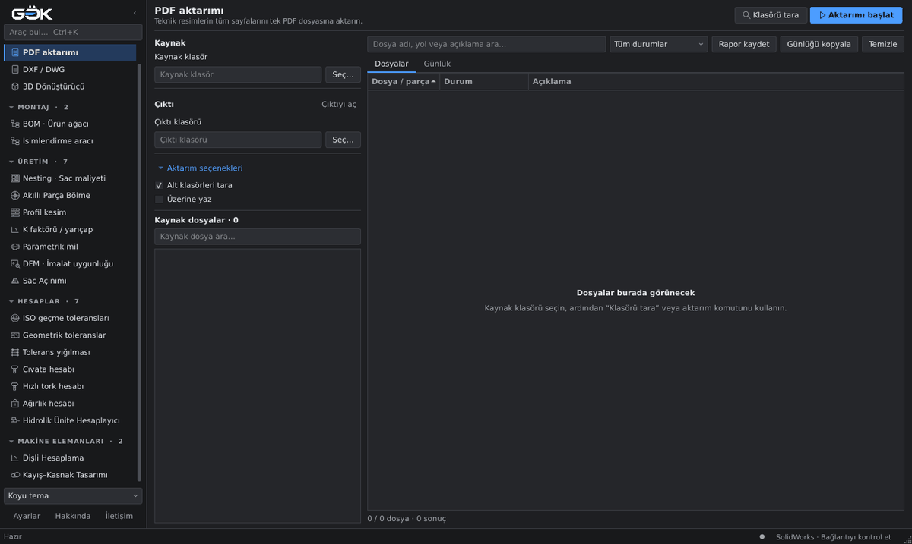

1. **PDF aktarımı** ekranında kaynak ve çıktı klasörünü seçin.
2. Alt klasörler de okunacaksa **Alt klasörleri tara** seçeneğini açın.
3. **Klasörü tara** ile bulunan `.SLDDRW` dosyalarını kontrol edin.
4. Mevcut PDF'leri yenileyecekseniz **Üzerine yaz** seçeneğini açın.
5. **Aktarımı başlat** düğmesine basın; sonuçları ve günlüğü inceleyin.

Her teknik resim için ayrı PDF oluşur. Aynı teknik resmin bütün sayfaları
aynı PDF dosyasında yer alır.

### DXF ve DWG açınımı

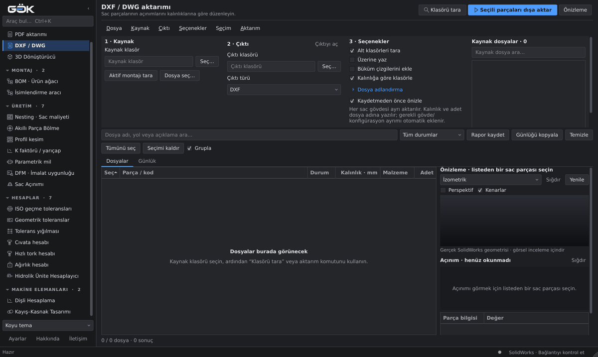

1. Montaj adetleri kullanılacaksa SolidWorks'te ana montajı ve doğru
   konfigürasyonu etkinleştirin.
2. **DXF / DWG** ekranında **Aktif montajı tara**, **Dosya seç…** veya
   kaynak klasörünü seçip **Klasörü tara** komutunu kullanın.
3. Listelenen sac gövdelerini, kalınlıkları ve adetleri inceleyin.
   Aynı dosyadaki farklı sac gövdeleri ayrı aktarılabilir.
4. Bir satıra tıklayıp sağdaki **3D görünüşü ve açınım önizlemesini** kontrol
   edin. CAD dosyasını değiştirdiyseniz **Yenile** ile tekrar okuyun.
5. Çıktı klasörünü ve **DXF / DWG** türünü seçin. İhtiyacınıza göre
   **Büküm çizgilerini ekle**, **Kalınlığa göre klasörle** ve adlandırma seçeneklerini ayarlayın.
6. Kaydetme öncesinde açınımları incelemek istiyorsanız **Kaydetmeden önce
   önizle** seçeneğini açın. Aktarılacak gövdeleri işaretleyip
   **Seçili parçaları dışa aktar** düğmesine basın.

Klasör taramasında açık ana montaj varsa kullanılan parçaların montaj
adetleri alınır. Ana montaj yoksa bağımsız parça dosyaları birer örnek sayılır.
**Grupla** seçeneğini kapatarak montaj örneklerini ayrı inceleyebilirsiniz.

Çıktı adında kalınlık ve adet bulunabilir; örneğin
`BRAKET - 1.5 mm - 12 adet.dxf`. Bu dosyaları daha sonra Nesting'e ekleyebilirsiniz.

[Ayrıntılı açınım rehberi](modules/dxf_dwg/README.md)

### 3D dosya aktarımı

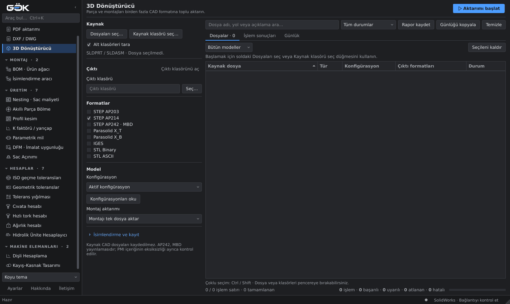

1. **3D Dönüştürücü** ekranında **Dosyaları seç…** veya **Kaynak klasörü seç…**
   ile `.SLDPRT` ve `.SLDASM` dosyalarını ekleyin.
2. Çıktı klasörünü seçin. STEP, Parasolid, IGES veya STL biçimlerinden
   ihtiyacınız olanları işaretleyin; birden fazla biçim seçebilirsiniz.
3. Aktif, bütün veya seçilen konfigürasyonların aktarılacağını belirleyin.
   Gerekirse **Konfigürasyonları oku** ile adları alın.
4. Montaj için **Montajı tek dosya aktar** veya **Bileşenleri ayrı aktar**
   seçimini yapın.
5. **Aktarımı başlat** düğmesine basın. Her biçimin çıktısı kendi klasörüne kaydedilir.

STEP AP242, SolidWorks MBD desteği ve uygun lisans gerektirir. STL
kullanıyorsanız birim ve kalite ayarlarını da kontrol edin.
Aktarım için açılan parça pencereleri işlem sonunda kapatılır; önceden açık
olan kullanıcı pencereleri korunur.

### BOM ve Excel

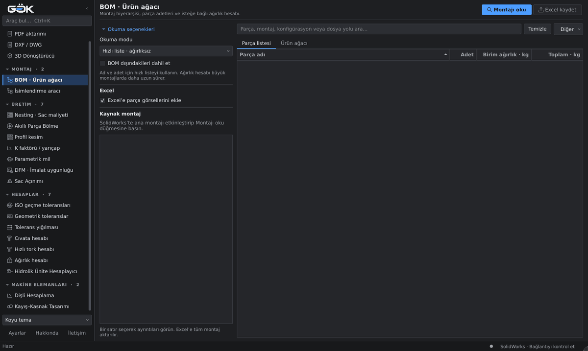

1. SolidWorks'te ürün ağacını alacağınız ana montajı etkinleştirin.
2. **BOM · Ürün ağacı** ekranında **Okuma modu** seçin. Ad ve adet için
   **Hızlı liste · ağırlıksız**, kütle bilgisi için **Ağırlıklarla birlikte**
   kullanılabilir. Eksik yüklenmiş alt montajlar için tam çözümleme seçeneğini inceleyin.
3. **Montajı oku** düğmesine basın; parça listesini, montaj ağacını ve uyarıları kontrol edin.
4. Excel'de izometrik görseller istiyorsanız **Excel’e parça görsellerini ekle**
   kutusunu işaretleyin. Görselsiz rapor için işareti kaldırın; bu durumda
   görseller alınmaz ve görsel sütunu eklenmez.
5. **Excel kaydet** düğmesine basıp dosya konumunu seçin.

Excel çıktısı okunan montajın tamamını kapsar. Ekrandaki arama ve filtreler
Excel kapsamını daraltmaz. Görsel alınamayan parçaların nedeni ilgili Excel
satırında belirtilir. Görsel tercihiniz sonraki kullanım için hatırlanır.

### Montaj dosyalarını yeniden adlandırma

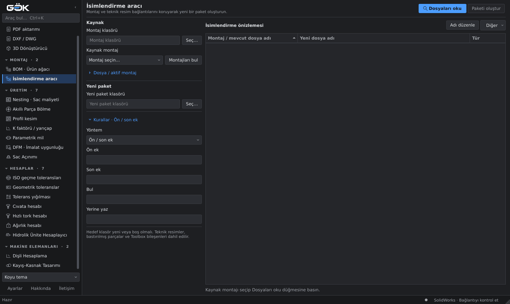

1. **İsimlendirme aracı** ekranında montaj klasörünü seçin.
2. **Montajları bul** ile kaynak montajı belirleyin veya
   **Aktif montajı kullan** seçeneğini kullanın.
3. **Yeni paket klasörü** için yeni ya da boş bir hedef klasör seçin.
4. **Dosyaları oku** düğmesine basın. Ön/son ek, numaralandırma veya
   bul–değiştir kurallarını girin; oluşacak dosya adlarını önizlemede kontrol edin.
5. **Paketi oluştur** ile yeni paketi kaydedin.

Sonuç, montaj ve teknik resim bağlantıları korunarak oluşturulan ayrı bir
pakettir. Paket tamamlandıktan sonra yeni klasördeki montajı açıp inceleyin.

### Nesting ve sac maliyeti


1. **Nesting · Sac maliyeti** ekranında **DXF ekle** ile DXF veya DWG dosyalarını seçin.
   Bir klasörü topluca okumak için **DOSYA → Klasör ve alt klasörlerden ekle…**
   komutunu kullanın; alt klasörler de taranır.
2. İçe aktarma tablosunda dosya adından önerilen **kalınlık ve adetleri**,
   malzemeyi ve birimi kontrol edin. **Kontrol ettim · İçe aktar** ile kabul edin.
3. Parça ağacındaki **Adet** hücresine çift tıklayıp sayıyı doğrudan yazabilirsiniz.
   **Enter** veya başka hücreye geçiş değişikliği uygular; **Esc** vazgeçer.
4. **Sac ve fiyatlar…** bölümünde levhanın enini, boyunu, kalınlığını,
   malzemesini, stok adedini ve fiyatını tanımlayın. Parça ile sacın malzeme
   ve kalınlıkları eşleşmelidir.
5. Kenar payını, parça aralığını, döndürme ve kalite seçimini ayarlayın.
   **Hesaplama süresini uygulama otomatik yönetir.**
6. **Yerleştir** düğmesine basın. Plaka sekmeleri veya sac listesindeki
   **1. plaka / 2. plaka / …** satırlarıyla yerleşimleri inceleyin.
7. Bütün parçalar yerleştiğinde **Dışa aktar** menüsünden DXF, Excel veya PDF alın.
   Projeye daha sonra dönmek için **DOSYA → Kaydet…** komutunu kullanın.

Sac tanımları otomatik kaydedilir ve yeni projelerde tekrar kullanılabilir.
Hesaplama, kayıtlı stok adedinden otomatik düşüm yapmaz.
Adet, geometri veya yerleşim payı değiştirildiğinde **Yerleştir** ile yeni plan oluşturun.

Uygun küçük parçalar için delik içi yerleşim otomatik değerlendirilir.
DXF ile oluşturulan kesim sırası dosyasını CAM hazırlığında inceleyin;
Nesting çıktısı doğrudan makine programı değildir.

DWG dosyaları uygulamanın içindeki dönüştürücüyle geçici DXF'e çevrilip aynı
kontrollerden geçer; kaynak DWG değiştirilmez. Çerçeveli toplu çizimlerde
(her parça bir çerçeve içinde, yanında adet yazısı) **Çerçeveli toplu çizim**
seçeneğiyle parçalar ve adetleri çizimden okunur.

[Ayrıntılı Nesting rehberi](modules/nesting/README.md)

### Akıllı parça bölme

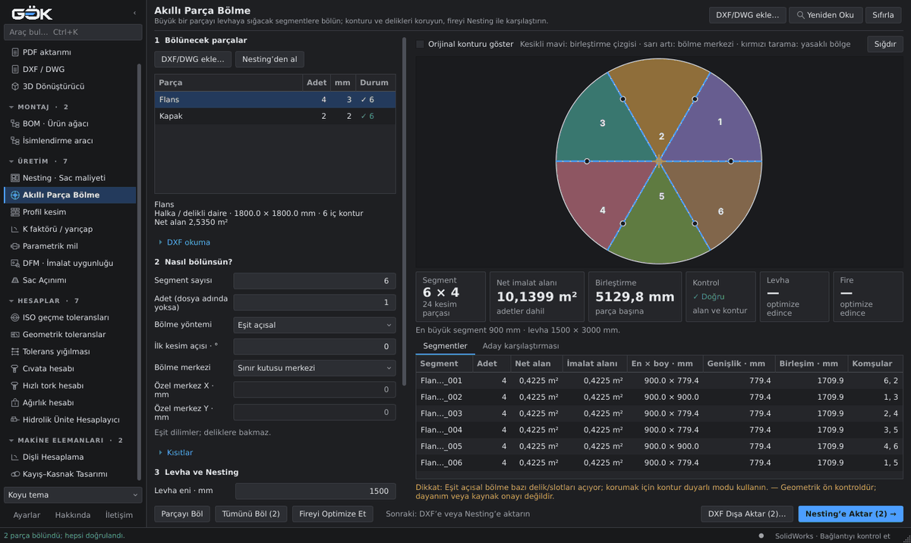

Levhaya sığmayan büyük daire, halka veya flanş gibi parçaları konturu ve
delikleri koruyarak segmentlere böler ve sonucu Nesting'e aktarır.

1. **DXF/DWG ekle…** ile bir veya birden çok dosya seçin ya da Nesting'de bir
   parça seçip **Nesting’den al** düğmesini kullanın. Adet ve kalınlık dosya
   adından okunur (`Flanş - 3 mm - 5 adet.dwg`); listede çift tıklayıp düzeltebilirsiniz.
2. **Nasıl bölünsün?** bölümünde segment sayısını, bölme yöntemini (eşit açısal
   veya deliklerden kaçan kontur duyarlı) ve bölme merkezini seçin. Gerekirse
   **Kısıtlar** altında delik mesafesi ve yasaklı bölgeleri girin.
3. **Levha ve Nesting** bölümünde levha ölçüsünü, malzemeyi ve kalınlığı kontrol edin.
4. **Parçayı Böl** seçili parçayı, **Tümünü Böl** listedeki bütün parçaları aynı
   ayarlarla böler. **Fireyi Optimize Et** farklı bölmeleri gerçek yerleşimde
   karşılaştırıp en az levha ve fireyi vereni gösterir.
5. **DXF Dışa Aktar** her segmenti ayrı DXF olarak kaydeder; **Nesting’e Aktar**
   segmentleri Nesting'e ekler.

Sonuç geometrik bir ön kontroldür; kaynak/bağlantı dayanımı hesaplanmaz.
[Ayrıntılı rehber](modules/smart_splitting/README.md)

### Profil kesim

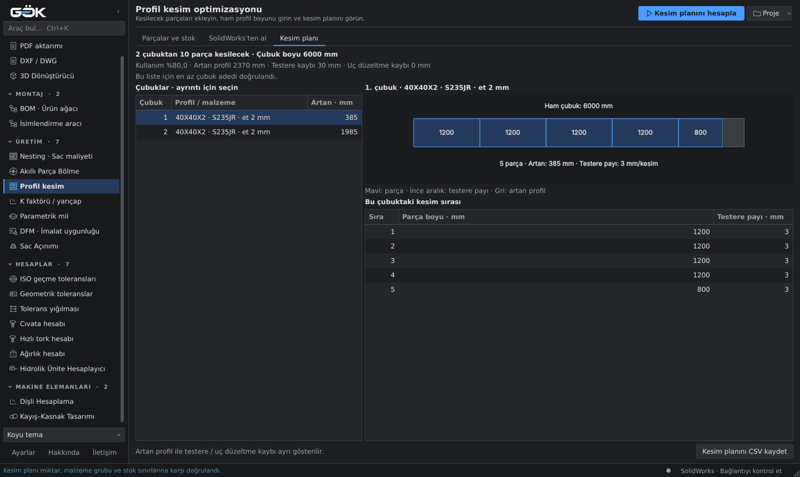

1. **Profil kesim → Parçalar ve stok** bölümünde **Parça ekle** düğmesine basın.
   Profil kesitini, malzemeyi, tek parça boyunu ve kesilecek adedi girin.
2. **Ham profil ve kesim payı** bölümünde satın alınan çubuğun boyunu,
   testere payını ve gerekiyorsa uç düzeltme miktarını tanımlayın.
   **6 metre çubuk için 6000 mm** girilir.
3. **Kesim planını hesapla** düğmesine basın. Çubuk sayısını, kesim sırasını
   ve artan boyları inceleyin; listeden çubuk seçerek çizimini görün.
4. **Kesim planını CSV kaydet** ile raporu alın. **Proje** menüsünden
   listeyi kaydedip yeniden açabilirsiniz.

İlk deneme için **Örnekle dene** düğmesini kullanabilirsiniz:
1200 mm'den 4 adet ve 800 mm'den 6 adet; 6000 mm çubuk ve 3 mm testere payıyla
2 çubuk gerekir, toplam 2370 mm artan ve 30 mm testere kaybı oluşur.

SolidWorks'ten liste almak için **SolidWorks’ten al → Açık modeli oku**
veya **Dosya seç…** komutunu kullanın. Eksik bilgileri kontrol ettikten sonra
**Hazır satırları listeye ekle** ile kesim listesine aktarın.
Farklı profil kesitleri ve malzemeler ayrı gruplarda hesaplanır.

### Parametrik mil

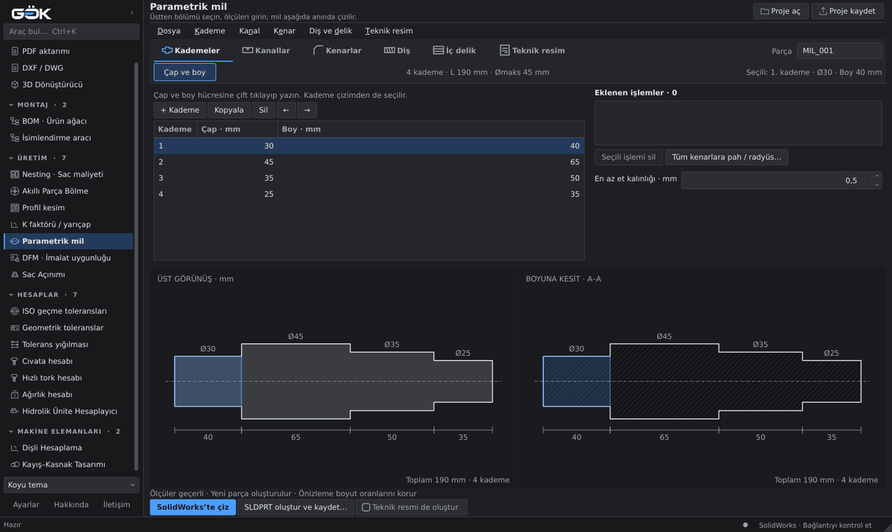

1. **Parametrik mil** ekranında parça adını girin; kademeleri soldan sağa
   sıralayarak her kademenin çapını ve boyunu mm cinsinden tanımlayın.
2. **Parametre bölümü** listesinden segman, kama, pah, radyüs veya diğer
   desteklenen işlemleri seçin. Hedef kademeyi ve ölçüleri girip **İşlemi ekle**'ye basın.
3. Bir işlemi değiştirmek için operasyon listesinden seçin.
   Yeni işlem için **Seçimi temizle · Yeni işlem** komutunu kullanın.
4. Üst görünüş ve boyuna kesiti kontrol edin. **SOLIDWORKS'TE ÇİZ** yeni bir
   parça oluşturur; **SLDPRT oluştur ve kaydet…** modeli dosyaya da kaydeder.
5. Parametreleri daha sonra düzenlemek üzere saklamak için **Proje kaydet**'i kullanın.

Kanal başlangıcı, hedef kademenin sol başlangıcından ölçülür.
Kama boyu yuvarlak uçlar dahil toplam uzunluktur; kanal derinliği yüzeyden
tabana doğru radyal mesafedir.

**Tek komutla pah/radyüs:** **Toplu pah / radyüs…** bölümünde türü ve ölçüyü
seçip **Tüm uç ve omuzlara uygula** düğmesine basın. Bu işlem mil uçları ve
kademe omuzlarını kapsar. **Mevcut pah/radyüsleri de değiştir** seçeneği kapalıyken
önceki işlemler korunur. Sonucu önizlemede inceleyip katı modeli oluşturun.

### K faktörü ve yarıçap

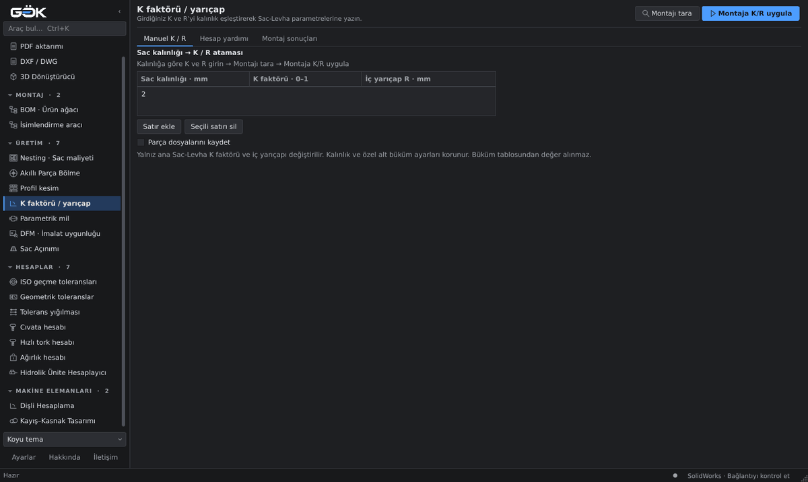

1. **K faktörü / yarıçap** ekranında bağımsız büküm hesabı veya montaja atama
   işlemini seçin.
2. Montaja atama için **Manuel K / R** bölümünde sac kalınlığı, K faktörü
   ve iç yarıçap değerlerini tanımlayın.
3. SolidWorks'te ana montajı etkinleştirip **Montajı tara** ile eşleşmeleri kontrol edin.
4. Dosya kaydetme seçiminizi kontrol edip **Montaja K/R uygula** düğmesine basın.

Atama model parametrelerini değiştirir. Kaydetme seçeneği başlangıçta kapalıdır;
yalnız tanımladığınız kalınlıklarla eşleşen uygun sac parçaları işlenir.

### Tolerans yığılması

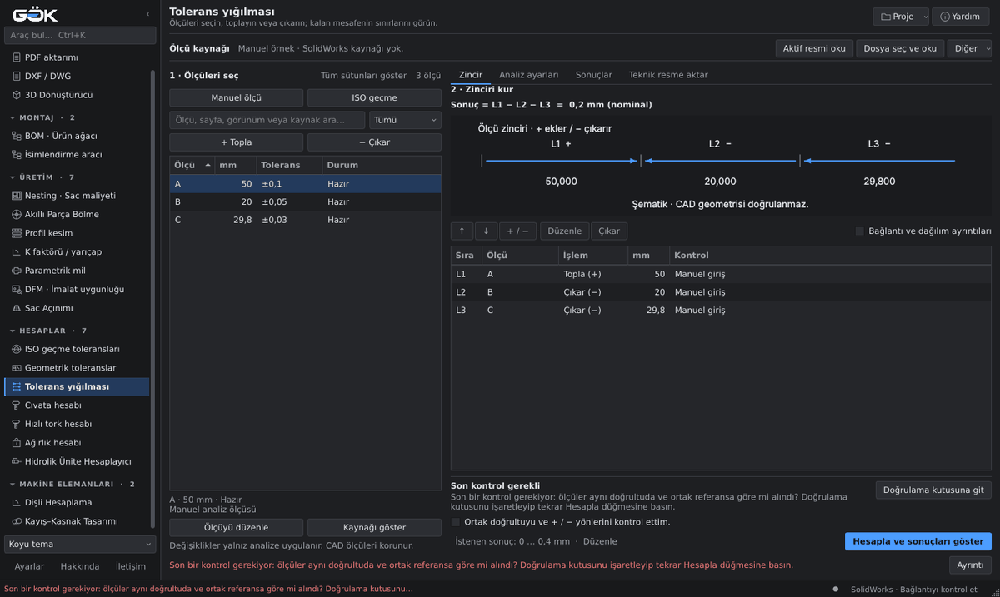

1. **Tolerans yığılması** ekranında manuel ölçüleri ekleyin veya
   SolidWorks teknik resimlerinden ölçü okuyun. İlk deneme için örnek analizi açabilirsiniz.
2. Sonuca eklenecek ölçüleri **+ Topla**, çıkarılacakları **− Çıkar** ile zincire alın.
3. Başlangıç/bitiş noktalarını, ölçü yönlerini ve ortak referansı kontrol edin;
   istenen sonuç aralığını tanımlayın.
4. Yönleri doğrulama kutusunu işaretleyip **Hesapla** komutunu kullanın.
5. Sonuçları ve katkıları inceleyin; PDF/Excel raporu veya proje kaydı oluşturun.

Girdi değiştirildiğinde yeniden hesaplama gerekir. Kaydedilmiş bir projeyi
açtığınızda da zinciri doğrulayıp hesaplayın. Teknik resme analiz notu eklemek
ayrı bir işlemdir; bu işlem öncesindeki kayıt ve kaynak seçimini kontrol edin.

### Sac açınımı

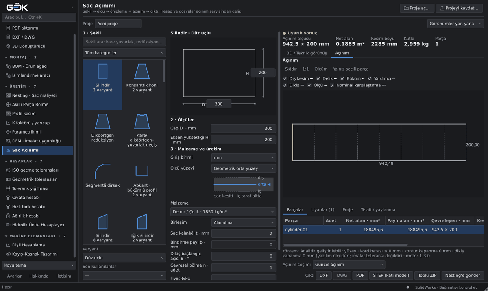

1. **Sac Açınımı** ekranında şekli seçin (silindir, koni, redüksiyon, kare–yuvarlak
   geçiş, dirsek, kanal ve diğer 51 aile); arama kutusunu kullanabilirsiniz.
2. Ölçüleri şema üzerinde veya formda girin; ölçü yüzeyini (iç/orta/dış),
   malzemeyi, sac kalınlığını ve birleşim tipini seçin.
3. Açınım ölçüsünü, net alanı, kesim boyunu ve kütleyi inceleyin; 3D ve açınım
   görünümlerini kontrol edin.
4. **DXF, PDF, STEP** veya **Toplu ZIP** olarak kaydedin ya da **Nesting'e gönder**
   ile doğrudan yerleşime aktarın. Projeyi kaydedip sonra açabilirsiniz.

[Ayrıntılı rehber](modules/sheet_unfolding/README.md)

### DFM ve imalat uygunluğu

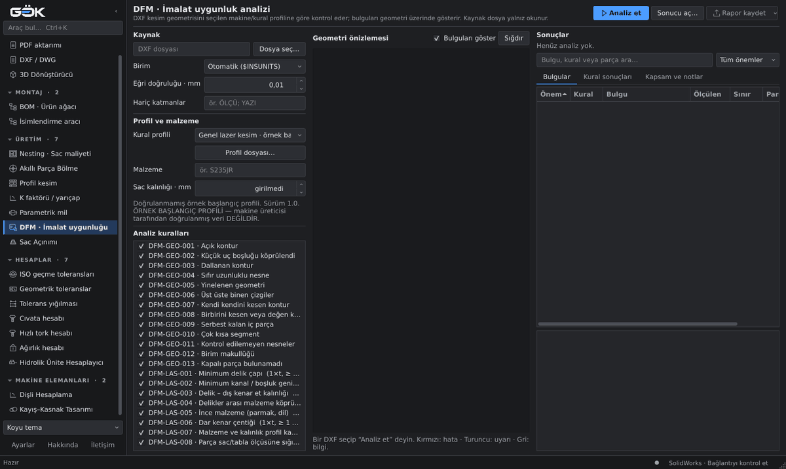

1. **DFM · İmalat uygunluğu** ekranında kontrol edilecek DXF dosyasını seçin.
2. Kural profilini (ör. lazer kesim) ve sac kalınlığını seçip analizi başlatın.
3. Bulgular çizimin üzerinde işaretlenir; HATA / UYARI / BİLGİ önem sırasıyla
   listeyi inceleyin ve JSON/CSV rapor alın.

Bu bir 2B geometri kontrolüdür; üretime uygunluk onayı değildir. Paketteki
lazer profili örnek başlangıç profilidir. [Ayrıntılı rehber](modules/dfm_analyzer/README.md)

### Hidrolik ünite hesaplayıcı

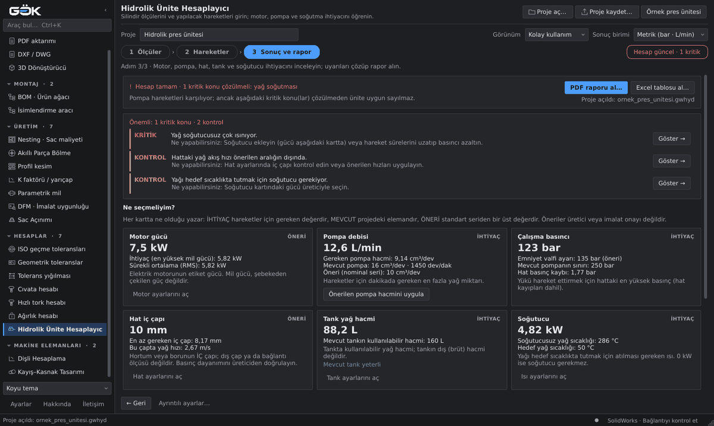

**Kolay kullanım** görünümünde üç adım vardır:

1. **Ölçüler:** piston çapını (silindirin iç çapı), mil çapını ve stroku girin.
   Çizim hangi ölçünün nerede olduğunu gösterir; gövde dış çapı girilmez.
2. **Hareketler:** her hareket için “Ne kadar yol alsın?”, “Kaç saniye sürsün?”
   ve gerekli itme/çekme kuvvetini girin. **İleri – bekle – geri örneğini kur**
   hazır bir sıra yazar. Kuvvet kN veya ton-kuvvet olarak girilebilir.
3. **Sonuç ve rapor:** motor gücü, pompa debisi, basınç, hat iç çapı, tank ve
   soğutucu ihtiyacı kartlarda İHTİYAÇ / MEVCUT / ÖNERİ ayrımıyla gösterilir.
   Uyarıların yanında ne yapılacağı ve ilgili alana giden **Göster →** düğmesi
   vardır. **PDF raporu** veya **Excel tablosu** alın.

Pompa, hat, yağ, tank, akümülatör ve çok silindirli projeler için görünümü
**Ayrıntılı ayarlar** yapın. Projeler `.gwhyd` dosyası olarak kaydedilir;
**Örnek pres ünitesi** ile hazır bir proje açılır. Sonuçlar ön boyutlandırmadır;
üretici veya imalat onayı değildir. [Ayrıntılı rehber](modules/hydraulic_unit/README.md)

### Dişli hesaplama

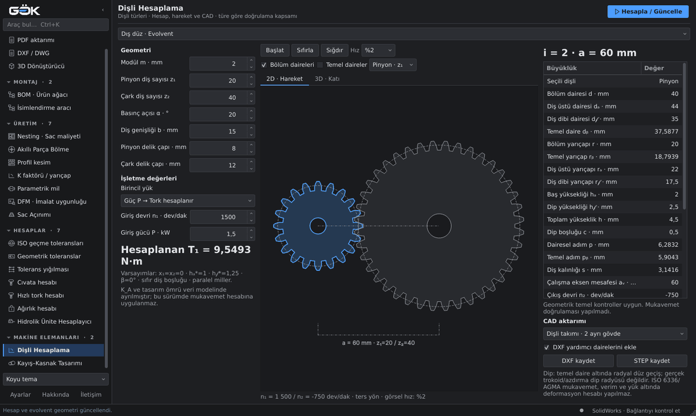

1. **Dişli Hesaplama** ekranında dişli türünü seçin. Başlangıç için
   **Dış düz · Evolvent** seçeneğini kullanabilirsiniz.
2. Modül, diş sayıları, genişlik, delik çapları ve işletme değerlerini girin.
3. **Hesapla / Güncelle** ile sonuçları ve 2D hareket görünümünü inceleyin.
4. Gerektiğinde **Gerçek katıdan 3D önizleme oluştur**, **DXF kaydet** veya
   **STEP kaydet** komutlarını kullanın. Diğer dişli türlerinde ekranda belirtilen
   hesap ve CAD desteğini kontrol edin.

### Kayış–kasnak tasarımı

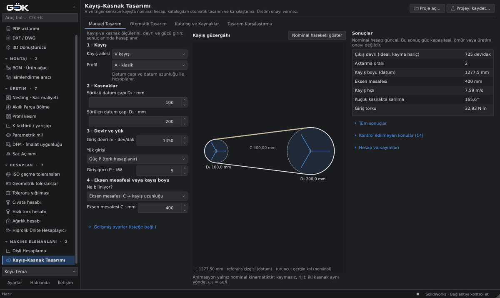

1. **Kayış–Kasnak Tasarımı** ekranında kayış türünü (V, triger/senkron vb.) seçin.
2. **Manuel** sekmesinde kasnak çaplarını, devri ve eksen mesafesini girip
   hesaplayın; kayış boyu, sarım açıları ve hızları inceleyin.
3. **Otomatik tasarım** sekmesinde güç ve devirlerden kasnak çapları ile kayış
   boyunu önerir; eksen mesafesini boş bırakabilirsiniz.

Ürün kataloğu ve güç tablosu değerlendirmesi ayrı seçeneklerdir; stok
bulunabilirliği iddia edilmez. [Ayrıntılı rehber](modules/belt_drive/README.md)

### Diğer hesap araçları

| ISO geçme toleransları | Geometrik toleranslar |
| --- | --- |
| 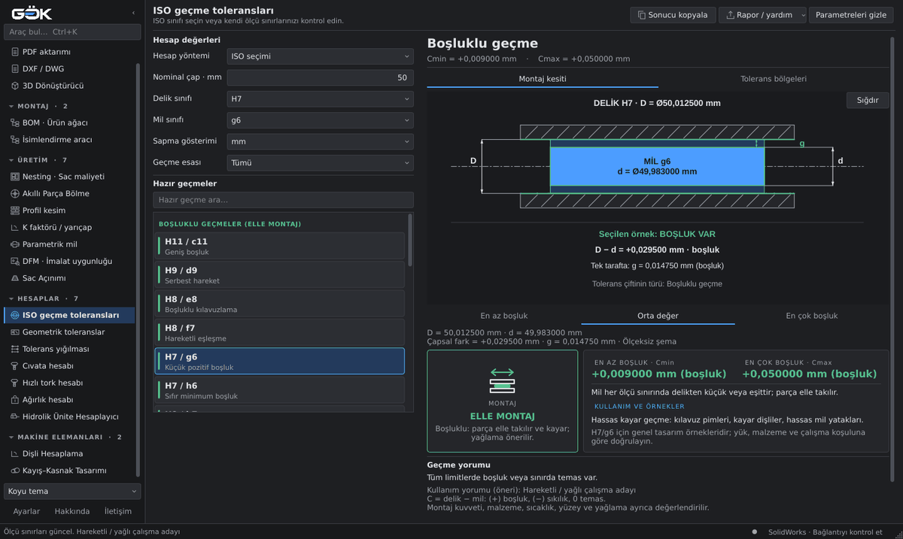 | 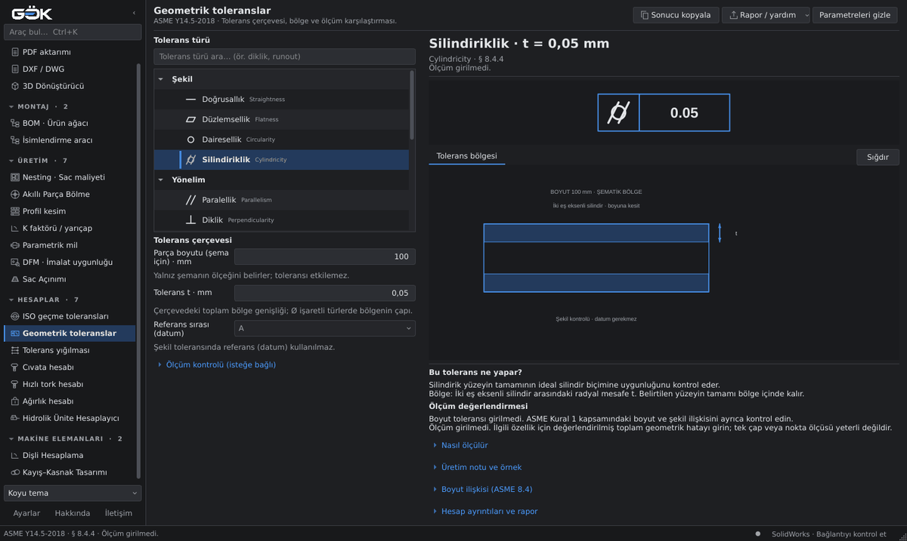 |

| Cıvata hesabı | Hızlı tork hesabı | Ağırlık hesabı |
| --- | --- | --- |
| 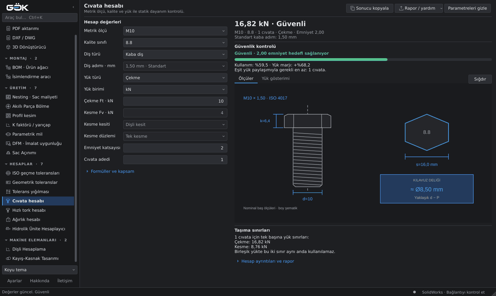 | 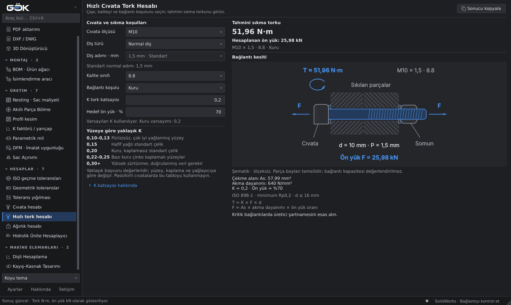 | 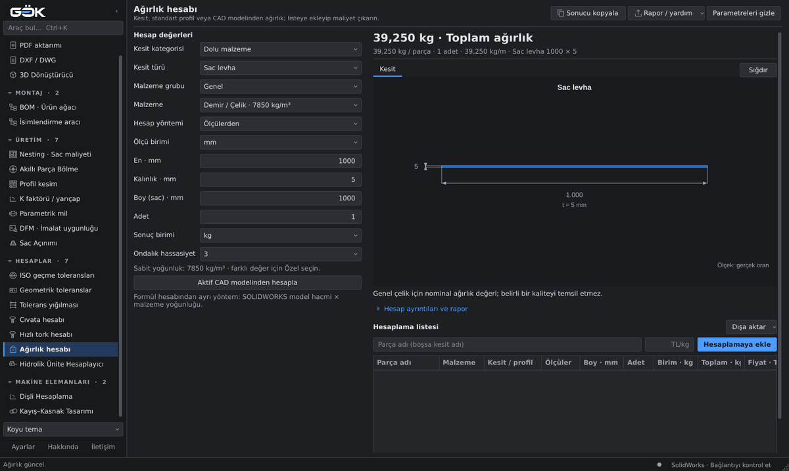 |

| Araç | Nasıl kullanılır? |
| --- | --- |
| ISO geçme toleransları | Nominal çapı ve delik/mil sınıflarını seçin. Manuel kontrolde alt ve üst sapmaları girin; limitleri, boşluk veya sıkılık aralığını inceleyin. |
| Geometrik toleranslar | Tolerans özelliğini seçin, tolerans değerini ve gerekli datumları girin; çerçeveyi, şemayı ve açıklamaları kontrol edin. |
| Cıvata hesabı | Çap, sınıf, cıvata adedi ve yükleri girin; birimleri kontrol edip statik dayanım ve emniyet sonuçlarını inceleyin. |
| Hızlı tork hesabı | Çap, cıvata sınıfı, diş tipi ve bağlantı koşullarını seçin; hesaplanan sıkma torku ve ön yükü inceleyin. |
| Ağırlık hesabı | Malzemeyi ve kesiti seçin; ölçüleri, birimi ve adedi girin. Toplam ağırlığı sonuç bölümünden okuyun. |

Hesap ve CAD çıktılarını kullanmadan önce ölçüleri, birimleri ve seçilen
varsayımların işinize uygunluğunu kontrol edin. Özellikle cıvata ve tork
hesaplarında üretici şartnamelerini; kesim çıktılarında üretim/CAM hazırlığını esas alın.

## Projeler ve kaydedilen tercihler

Klasör seçimleri, görünüm tercihleri ve Nesting sac tanımları otomatik
hatırlanır. **Nesting, Profil kesim, Parametrik mil, Tolerans yığılması, Sac Açınımı ve Hidrolik Ünite**
çalışmalarınızı kendi proje kaydetme komutlarıyla saklayın.
Proje dosyası düzenlemeye devam etmek, PDF/Excel/DXF/STEP gibi çıktılar
ise sonucu paylaşmak veya sonraki işleme taşımak içindir.

Sürüm ve kaynak revizyonunu **Hakkında** ekranında bulabilirsiniz.
Windows hata günlükleri `%LOCALAPPDATA%\GOKWORKS\logs` klasöründedir.

## Sorun giderme

| Karşılaşılan durum | Kontrol edilecekler |
| --- | --- |
| SolidWorks bağlantısı kurulamıyor | SolidWorks'ün açık olduğunu, iki uygulamanın aynı Windows kullanıcı oturumunda ve yetki seviyesinde çalıştığını kontrol edin. Alt çubuktaki **Bağlantıyı kontrol et** komutunu kullanın. |
| Yanlış parça, adet veya konfigürasyon okunuyor | SolidWorks'te doğru ana montajı ve konfigürasyonu etkinleştirip yeniden tarayın. |
| DXF/DWG'de parça görünmüyor veya sac olarak tanınmıyor | Parçanın ilgili konfigürasyonunda gerçek sac metal gövdesi ve açınım tanımı bulunduğunu kontrol edin. Açınımı SolidWorks'te inceleyip modeli **Ctrl+B/Ctrl+Q** ile güncelleyin, ardından tekrar tarayın. |
| Aynı dosya yeniden aktarılmıyor | Çıktı klasöründe mevcut dosya olup olmadığını ve **Üzerine yaz** seçimini kontrol edin. |
| Nesting'de bazı parçalar yerleşmiyor | Parça/sac malzeme ve kalınlık eşleşmesini, levha ölçülerini, stok adedini, aralık ve kenar paylarını kontrol edip yeniden yerleştirin. |
| Nesting dışa aktarma düğmesi kapalı | Bütün parçaların yerleştiğini ve son değişiklikten sonra hesabın yenilendiğini kontrol edin. |
| DWG eklenemiyor veya kontur eksik okunuyor | Durum satırındaki dosya hatasını okuyun. Pakete gömülü okuyucu bazı yeni (R2010 sonrası) DWG nesnelerini atlayabilir; dosyayı CAD programında DXF olarak kaydedip ekleyin. |
| BOM Excel'inde görseller yok | **Excel’e parça görsellerini ekle** seçeneğini kontrol edin. Görsel alınamayan parçanın Excel satırındaki açıklamasını okuyun. |
| Durdur'a bastıktan sonra bekliyor | Devam eden SolidWorks çağrısının bitmesi gerekebilir. Durum çubuğunu ve günlüğü izleyin. |
| PyCharm `python.exe` için sözdizimi hatası veriyor | Çalıştırma ayarında **Script path** alanını `main.py`, Python yorumlayıcısını `.venv\Scripts\python.exe` olarak seçin. |
| Python bir modülün bulunamadığını söylüyor | Doğru `.venv` yorumlayıcısını kullandığınızı kontrol edin; aşağıdaki bağımlılık kurulum komutunu çalıştırın. |

Hata bildirirken kullandığınız modülü, **Hakkında** ekranındaki revizyonu,
yaptığınız işlemi ve **Ayrıntı / Günlük** metnini paylaşın.

## Kurulum ve güncelleme

### Kaynak koddan çalıştırma

Windows'ta **Python 3.13, 64 bit** kurulu olmalıdır. Depoyu klonlayın veya
**Code → Download ZIP** ile indirip arşivi çıkarın. Terminali `main.py` ve
`requirements.txt` dosyalarının bulunduğu proje klasöründe açın.
İlk kurulumda aşağıdaki satırları sırayla çalıştırın:

```powershell
py -3.13 -m venv .venv
.\.venv\Scripts\python.exe -m pip install -r requirements.txt
.\.venv\Scripts\python.exe main.py
```

Sonraki açılışlarda yalnız son komut yeterlidir.

### PyCharm üzerinden çalıştırma

1. **File → Open** ile `main.py` dosyasının bulunduğu proje klasörünü açın.
2. Python yorumlayıcısı olarak proje içindeki `.venv\Scripts\python.exe` dosyasını seçin.
3. Üstteki çalıştırma profili menüsünden **Edit Configurations…** bölümünü açın.
   **Script path:** `main.py`; **Working directory:** proje klasörü olmalıdır.
4. **Run** ile uygulamayı başlatın. İlk kurulum için yukarıdaki komutları
   PyCharm'ın **Terminal** sekmesinde de çalıştırabilirsiniz.

### EXE oluşturma

Kaynak kurulumunuz hazırsa proje klasöründeki terminalde:

```powershell
.\.venv\Scripts\python.exe -m pip install -r packaging\windows-requirements.txt
.\.venv\Scripts\python.exe packaging\build_windows.py
```

Derleme tamamlandığında çıktı **`dist\GOKWORKS.exe`** olur. Dosyayı başka
bir klasöre taşıyarak çalıştırabilirsiniz. Bu işlem GitHub'a yayın yapmaz.
[Ayrıntılı Windows derleme rehberi](packaging/README.md)

### Güncel kodu alma

Depoyu Git ile aldıysanız uygulamayı kapatın ve proje klasöründe çalıştırın:

```powershell
git pull origin main
.\.venv\Scripts\python.exe -m pip install -r requirements.txt
```

Ardından `main.py` ile açın. EXE kullanıyorsanız güncel kaynak koddan yeniden
EXE oluşturun. ZIP ile kurulum yaptıysanız kişisel proje ve çıktı dosyalarınızı
koruyarak güncel kaynak paketini ayrı bir klasöre çıkarabilirsiniz.

## Geliştirici ve iletişim

- **Geliştirici:** Orhan Gökkızıl
- **E-posta:** [orhangokkizilwork@gmail.com](mailto:orhangokkizilwork@gmail.com)
- **LinkedIn:** [Orhan Gökkızıl](https://www.linkedin.com/in/orhan-g%C3%B6kk%C4%B1z%C4%B1l/)
- **GitHub:** [gkkizil/gokworks](https://github.com/gkkizil/gokworks)

[Ayrıntılı modül rehberleri](modules/README.md) · [Geliştirme belgeleri](docs/repository-structure.md)

Bu bağlantılara uygulamanın sol altındaki **İletişim** bölümünden de ulaşabilirsiniz.
